[Back to Portfolio](./)

Stay on Track Web Application
===============

-   **Class: CSCI 498, 499** 
-   **Grade: In Progress** 
-   **Language(s): Ruby, Javascript, HTML/CSS** 
-   **Source Code Repository:** [Link to Repository](https://github.com/mcabane/CSU-Senior-Project/tree/master)
    (Please [email me](mailto:example@csustudent.net?subject=GitHub%20Access) to request access.)

## Statement of Purpose

When it comes to productivity and task trackers they are usually designed for students 
and are not suited to keeping track of life related tasks that do not occur frequently. 
When a person is busy with responsibilities it can be difficult to keep track of 
appointments, deadlines, maintenance, and other non-regular day-to-day chores.

If important dates are not kept track of, it can leave people rushing to complete 
important tasks like filing taxes to the last minute. If consistent appointments are 
not maintained it could result in a decline in health or health conditions going 
undiscovered and untreated. If maintenance of appliances or vehicles is left 
neglected; it could result in serious damage. For example, if a dryer vent is left 
blocked; it could result in a house fire.

A solution to maintaining an organized list of non-frequent and important life-related
tasks is the Stay on Track web application. Users will be able to set recurring 
reminders of appointments, maintenance, deadlines, expiration dates of licenses/tags, 
and other non-frequent tasks.

## Research & Background
Research begin with researching types of appointments and maintenance that often get 
forgotten. Completion of User-Interfacing Programming course, which is why I decided to use Ruby on Rails 
as I had gained experience using it in the course. Followed by learning more about Ruby on Rails, Fly.io for 
deployment, and turning illustrations into SVG files. I used Adobe Illustrator when designing all the icons
as I have used it for several years. 

Useful resources: 
- [Ruby on Rails documentation](https://api.rubyonrails.org/classes/ActiveSupport/Duration.html#method-i-to_i)
- [For adding User Preferences - Aneeqa Khan](https://dev.to/aneeqakhan/a-developers-guide-to-browser-storage-local-storage-session-storage-and-cookies-4c5f)
- [CSS and Buttons - W3schools](https://www.w3schools.com/cssref/pr_pos_z-index.php)
- [Eventlisteners - Mozilla](https://developer.mozilla.org/en-US/docs/Web/API/EventTarget/addEventListener)
- [Contrast Checker - WebAIM](https://webaim.org/resources/contrastchecker/)
- [Web Application Deployment - Fly.io](https://fly.io/docs/rails/getting-started/dockerfiles/)
- [Dockerfile Reference - AkitaOnRails](https://akitaonrails.com/en/2026/02/20/sqlite-kamal-rails-deploy-without-drama-behind-the-m-akita-chronicles/?utm_source=copilot.com)
- Referenced material from User-Interface Programming Course

## Project Language(s)
- Ruby on Rails
- Javascript
- HTML/CSS
 
## Additional Software & Hardware
- Visual Studio Code
- Adobe Illustrator
- Windows Personal Computer

## Project Requirements
**ID Number:** 1  
**Type:** Functional  
**Description:**  
Users are able to create a task with a title, description, date, and recurrence
frequency (monthly, 6 months, year, or custom).  
**Rationale:**  
To create an efficient way for the user to manage recurring tasks and important
deadlines.    
**Fit Criterion:**    
The user is able to fill out the task details by typing into text fields, the
recurrence frequency is selected by dropdown. The task when created will be
added to the list with the correct title, description, date, and frequency.
Recurring dates must be automatically created with the specific interval.  
**Priority:** High  
**Dependencies:** ID 10

---

**ID Number:** 2    
**Type:** Functional    
**Description:**    
Users are able to delete or edit existing tasks to modify details without having
to create a new one.  
**Rationale:**    
Keeps the task management updated to the users needs and prevents cluttering the
dashboard with tasks that are no longer needed.  
**Fit Criterion:**    
When editing the user will save the changes by clicking the save button. If
user is deleting task, a warning message will appear to confirm deletion and
show how many instances of that task will be deleted. Tasks will reflect the
modified edits and have the correct information. Deleted tasks are no longer
displayed.  
**Priority:** High    
**Dependencies:** ID 1

---

**ID Number:** 3    
**Type:** Useability    
**Description:**    
Users can select from default categories or create new categories for tasks and
events.  
**Rationale:**    
Categories will aid with organizing by allowing the user to group tasks and
events by type, such as appliance maintenance, car maintenance, or
documents/licenses management.  
**Fit Criterion:**    
When creating a task the user can choose the category it falls under or add a
category to an existing task. The category is added by the user selecting the
from the dropdown menu.  
**Priority:** High  
**Dependencies:** ID 1, ID 2

---

**ID Number:** 4    
**Type:** Functional    
**Description:**    
Allow users to mark tasks with levels of urgency.  
**Rationale:**    
This will help prioritize tasks based on the level of urgency.  
**Fit Criterion:**    
The urgency status will be visually represented by color and text, which the 
user can select the level from a dropdown.  
**Priority:** Medium    
**Dependencies:** ID 1, ID 2

---

**ID Number:** 5    
**Type:** Functional    
**Description:**    
Allow users to mark whether deadlines are concrete or flexible.  
**Rationale:**    
With deadlines differentiated between flexible and concrete will help with
prioritization. Flexible deadlines could be postponed and concrete deadlines
are given more priority.  
**Fit Criterion:**    
Concrete deadlines will have the task’s date locked with flexible deadlines
still editable. For concrete deadlines they can only be changed if the concrete
status is changed.  
**Priority:** Medium    
**Dependencies:** ID 1, ID 2

---

**ID Number:** 6    
**Type:** Functional    
**Description:**    
Determines the priority of the tasks/events based on level of urgency and
deadline status.  
**Rationale:**    
Helps identify the tasks with the highest importance by taking into account
urgency and deadline constraints.  
**Fit Criterion:**    
Tasks with high urgency and concrete deadlines are assigned the highest priority
with tasks of low urgency and flexible deadlines assigned lower priority.    
**Priority:** High    
**Dependencies:** ID 1, ID 3, ID 4, ID 5

---

**ID Number:** 7    
**Type:** Look and Feel    
**Description:**    
Users can view the tasks on a dashboard where it displays overdue, upcoming, and 
completed tasks.  
**Rationale:**    
Being able to see the tasks in one place allows the user to visually see the
tasks that require immediate attention.  
**Fit Criterion:**    
The tasks are displayed correctly based on priority and organized by category. 
The tasks will be displayed in a consistent format of the same width sizing. The
display of the tasks will be in columns and rows.    
**Priority:** High    
**Dependencies:** ID 1, ID 3, ID 6

---

**ID Number:** 8    
**Type:** Functional    
**Description:**    
Allow users to mark tasks as complete.  
**Rationale:**    
Once a task is complete it no longer has to be in the list of tasks that need to
be completed and recurring tasks would not need to be deleted.  
**Fit Criterion:**    
The completed tasks are moved to a different section and will have a completed
date added for that instance of recurring tasks.  
**Priority:** Medium    
**Dependencies:** ID 1, ID 2, ID 3

---

**ID Number:** 9    
**Type:** Look and Feel    
**Description:**    
Visual representation of the task progress of categories using counters.
**Rationale:**    
Provides a visual representation of the user’s progress and to summarize if
certain categories are being neglected.  
**Fit Criterion:**    
The counters will display the number of tasks in the sections: overdue, 
upcoming, and completed.  
**Priority:** Medium    
**Dependencies:** ID 1, ID 2, ID 7

---

**ID Number:** 10    
**Type:** Functional    
**Description:**    
Enable recurring scheduling of tasks.  
**Rationale:**    
Makes it convenient to the user to schedule recurring tasks that have the same
details without having to repeatedly create the same tasks that occur after a
specific time frame.  
**Fit Criterion:**    
Users can set the time interval of the time between the repeating task within
the range of days to year. The user can make the selection by selecting from
dropdown. The user will have a custom option, which will notify where the user
can input a number value for the chosen time unit between recurring tasks.    
**Priority:** Medium    
**Dependencies:** ID 1, ID 2

---

**ID Number:** 11  
**Type:** Convenience  
**Description:**  
In the task dashboard, display a countdown of the days remaining for the tasks
using the deadline and current date.  
**Rationale:**  
Displaying the number of days would help the user gauge the time remaining
rather than looking at a date.  
**Fit Criterion:**  
Displays the correct number of days between the current date and the task
deadline.  
**Priority:** Low  
**Dependencies:** ID 7

---

**ID Number:** 12  
**Type:** Personalization and Internationalization  
**Description:**  
Users will be able to select a color theme.  
**Rationale:**  
Allows for the interface to match the user’s preference.  
**Fit Criterion:**  
The user will be able to change between default and dark mode using the button. 
The theme should apply with correct colors and maintain readability.  
**Priority:** Low  
**Dependencies:** ID 3, ID 7

---

**ID Number:** 13  
**Type:** Convenience  
**Description:**  
Allow the user to determine which categories appear on the dashboard.  
**Rationale:**  
Gives the user more control with which categories they would like to focus on at
that specific time.  
**Fit Criterion:**  
The user can filter the categories by using a checkbox next to the category
name, with the default showing all categories. The dashboard would correctly
display the tasks in the selected category. This would not delete the tasks in
the categories not chosen.  
**Priority:** Medium  
**Dependencies:** ID 7

---

**ID Number:** 14    
**Type:** Accessibility  
**Description:**    
Allow users to change the sizing of the text.  
**Rationale:**  
Depending on the user’s needs, larger text size might be needed for
accessibility.  
**Fit Criterion:**    
The sizing of the text is accurately changed and displays correctly without
altering the appearance of the tasks and icons. Such as no overflow text or
text overlapping.  
**Priority:** Medium    
**Dependencies:** ID 7

---

**ID Number:** 15    
**Type:** Usability    
**Description:**  
Reminders for special events that would require earlier preparation before date.  
**Rationale:**  
For events like birthdays or attending weddings, additional steps like ordering
gifts or planning transportation like air travel might be needed.  
**Fit Criterion:**    
Special text appears along with the task on the dashboard to remind the user of
preparation.  
**Priority:** Low  
**Dependencies:** ID 7

---

**ID Number:** 16    
**Type:** Convenience  
**Description:**  
Enable the ability to add additional notes to a task.  
**Rationale:**  
With a long term time frame between creating the task and the task deadline
information needed is likely to be forgotten. Information like passwords or
location of items.  
**Fit Criterion:**  
The notes will be viewed on separate page and are labeled by the task they
belong to.  
**Priority:** Low    
**Dependencies:** ID 7

---

**ID Number:** 17    
**Type:** Functional    
**Description:**  
Users will be able to mark their availability to help scheduling.  
**Rationale:**  
If the user has a consistent schedule of either working or classes it would be
helpful to be recommended times to set important tasks/events.  
**Fit Criterion:**  
The user is able to add time blocks to mark when they are busy on that given
day. It will be in a format organized by weekday or month depending on user's
selection of checkbox. Once the user’s schedule is added, the recommended times
will update to match.  
**Priority:** Low  
**Dependencies:** None

---

**ID Number:** 18    
**Type:** Functional  
**Description:**  
Warns users if they are scheduling tasks on the same time frame on the same day.  
**Rationale:**  
If the task is a recurring appointment at a specific time it cannot overlap with
another appointment.  
**Fit Criterion:**  
Text message appears to warn the user about the conflicting times and suggests a
different time/date.  
**Priority:** Low    
**Dependencies:** ID 17

---

**ID Number:** 19    
**Type:** Convenience    
**Description:**  
Email sent to the user of a report of upcoming tasks or events.  
**Rationale:**    
Provides additional reminders to the user with a weekly/monthly report of
upcoming tasks/events without the user having to open the web application.  
**Fit Criterion:**  
Email is sent to the user that contains the correct tasks that will be occurring
in that week/month. The email should be sent on the weekday specified by user.  
**Priority:** Medium    
**Dependencies:** ID 1, ID 3, ID 6, ID 20

---

**ID Number:** 20    
**Type:** Functional    
**Description:**  
Allow users to create an account by filling out a form for username, email, and
password.  
**Rationale:**  
This would allow for users to have individual accounts to save their tasks and
allow them to sign in on different devices.  
**Fit Criterion:**  
The user would be able to create an account by submitting the form and be able
to access their specific data by logging in. Once logged in their account
details should match the user. The user will be notified by having a
confirmation message appears.  
**Priority:** High    
**Dependencies:** ID 21

---

**ID Number:** 21    
**Type:** Security    
**Description:**  
Prevents the creation of an account of an email that is already in use and
requires the entry of valid email addresses and password that matches the
requirements.  
**Rationale:**  
This would ensure that each account is created using a unique email and ensures
that the user is using a password that is more secure.  
**Fit Criterion:**  
Validates email formats and checks email addresses with existing accounts.
Checks that passwords meet the requirements which are displayed to the user
using text. If it does not pass the requirements, an error message will appear
describing which requirements are not met. If all requirements are met, then
account creation can proceed.  
**Priority:** High  
**Dependencies:** ID 20

---

**ID Number:** 22    
**Type:** Convenience  
**Description:**  
Enable the use of a search function for the tasks and events.  
**Rationale:**  
Rather than have the user manually search a task that they might wish to view,
edit, or delete allows for a quick and efficient way to search.  
**Fit Criterion:**  
The user will be able to type in a search bar and apply filters by clicking
checkboxes. The results should include tasks that are based on the user input
such as the title and category. It should be able to handle partial matches and
allows for filtering by date, level of urgency, or concrete/flexible deadline.  
**Priority:** Medium     
**Dependencies:** ID 1

---

**ID Number:** 23    
**Type:** Understandability and Politeness    
**Description:**  
Provide descriptions of how to use the web application.  
**Rationale:**  
Allows for first time users to navigate the web application with ease and aid in
their understanding of how to complete the actions.  
**Fit Criterion:**  
Text descriptions will be displayed and when hovering over with the mouse will
provide a short description about the object.  
**Priority:** Medium  
**Dependencies:** ID 7

---

**ID Number:** 24    
**Type:** Personalization and Internationalization    
**Description:**  
Enable the user to track long term goals alongside recurring tasks.  
**Rationale:**  
As web application is used to track long term recurring tasks, it would be more
convenient for the user to also track their long term goals.  
**Fit Criterion:**  
Similar to task creation with changes, it should include title, description,
milestones, deadlines, and visually different from other tasks/categories by
using a different shape. The milestones will marked by user with a checkbox when
they reach it.    
**Priority:** Low    
**Dependencies:** ID 1, ID 7

---

**ID Number:** 25    
**Type:** Personalization and Internationalization    
**Description:**  
Enable the user to track how often they complete tasks and which months are they
the most productive/busy.  
**Rationale:**  
By seeing their progress the user will feel motivated to continue completing
tasks and maintenance. Being able to see their busy months would allow them to
do tasks earlier to lessen their load.  
**Fit Criterion:**  
Display texts with the description of most productive month and busy month with
the correct months based on the user's data.  
**Priority:** Low  
**Dependencies:** ID 7, ID 8

---

**ID Number:** 26  
**Type:** Useability  
**Description:**  
Enable the user to access the web application on different devices.  
**Rationale:**  
Not all users will have the same device with the same screen size and having a
responsive design will allow the web application to be used on smaller screens
while maintaining useability.    
**Fit Criterion:**  
Display texts and images in a format that that does not cause the tasks to
overflow, overlap, or become unreadable when the web application is used on
different sized screens. Check that the web application still maintains an
organized appearance when using smaller screens, such as a phone.  
**Priority:** Medium  
**Dependencies:** ID 7

---

**ID Number:** 27  
**Type:** Privacy  
**Description:**  
Enable the user delete their account that they no longer wish to use.  
**Rationale:**  
When there is an option to create an account, a way to delete the account is
needed. It would also benefit the user of having a simple way of removing
their data.  
**Fit Criterion:**  
User is able to delete account by selecting delete account button. A message
will appear, confirming that the user wants to delete their account. If the user
selects 'no', the account is not deleted and should retain all its data. If
the user selects 'yes', the account will be deleted and their data no longer
stored in the database. The user should also no longer receive email
notification of upcoming tasks. The user will only be able to delete their own
account, no effect will be made on the accounts of other users.    
**Priority:** Medium  
**Dependencies:** ID 19, ID 20

---

**ID Number:** 28  
**Type:** Ease of Use  
**Description:**  
Enable the user to change settings of features by using the settings page.  
**Rationale:**  
Users prefer having more control of the product they are using. With all the
settings in one place, it is more convenient for the user to make changes rather
than searching for the setting of a specific feature somewhere else.  
**Fit Criterion:**  
User is able to change the settings of color theme, text sizing, task display,
receiving notification, when emails sent, showing help descriptions,
account details, and account deletion. The changes to the selected features will
be correctly applied when the user selects the save changes button. The user can
click a reset to default button, that will return all settings to default.  
**Priority:** Low  
**Dependencies:** ID 7, ID 12, ID 14, ID 19, ID 20

---

## Project Implementation Description & Explanation

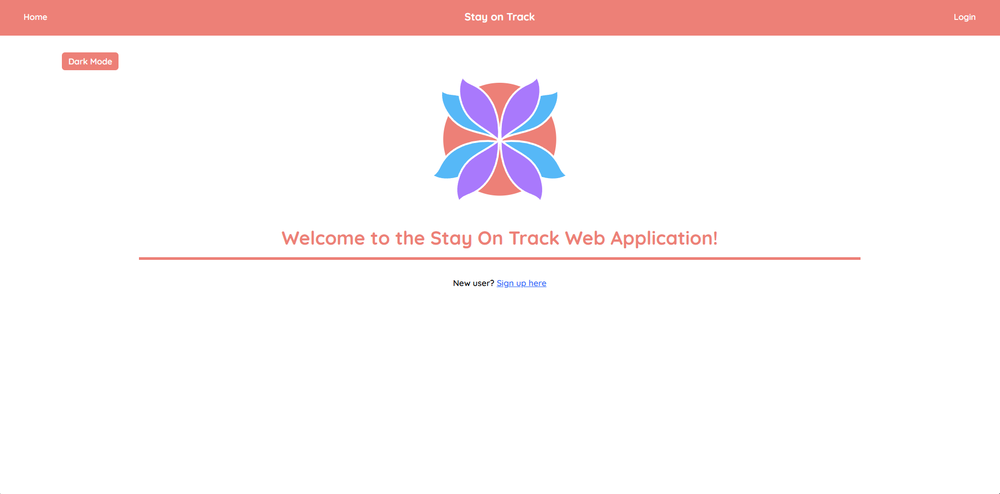  
Fig 1. The landing page
The landing page is only shown to users that are not logged in.  

 
 

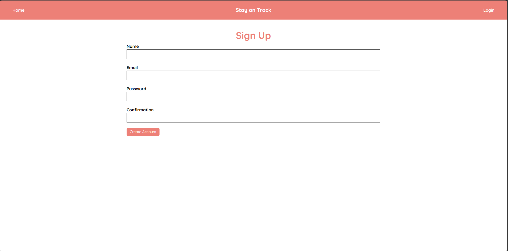  
Fig 2. Sign Up Page
To create an account users will be prompted to enter name, email, and password. 

 
 

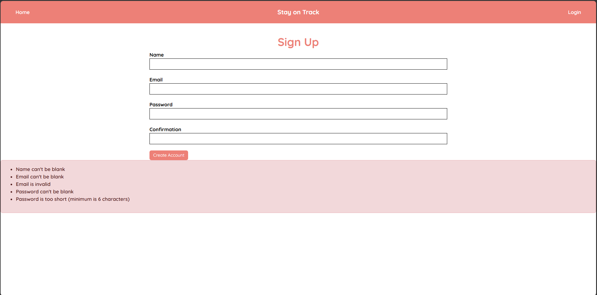  
Fig 3. Feedback when an error occurs during sign up. 
The validation checks for any blank input field, email matches valid regex format, 
and that password is more than 6 characters.

 
 

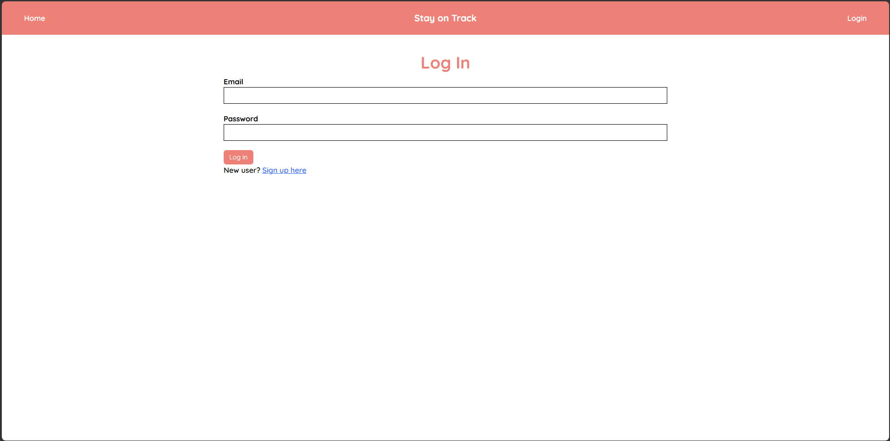  
Fig 4. Login Page.
The login page will prompt user for email and password. 

 
 

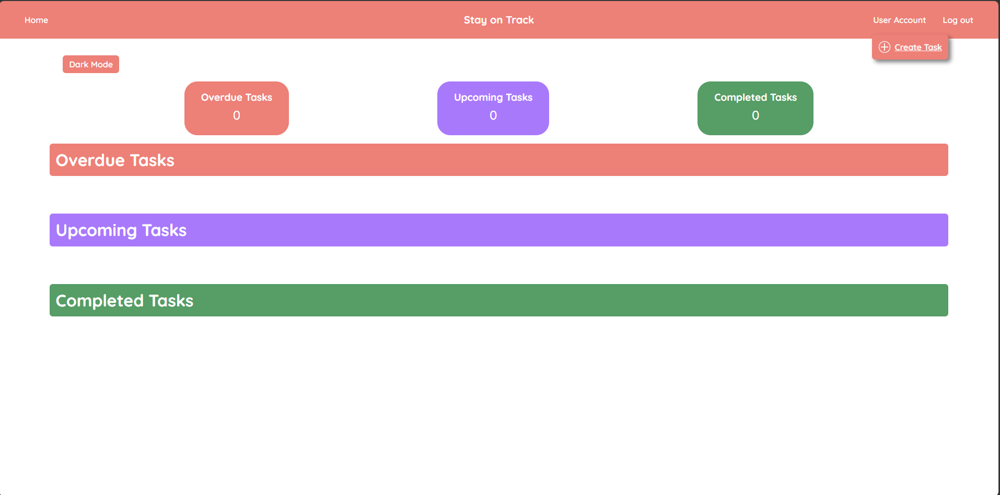  
Fig 5. Dashboard with no tasks.
When the account is successfully created the user will see the user dashboard. 
With no tasks created only the empty sections will be shown. 

 
 

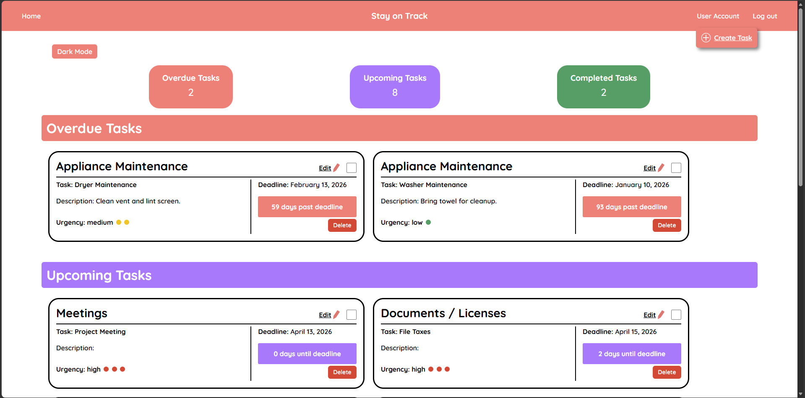  
Fig 6. Example of Dashboard with tasks
When the user is logged in they will see all tasks they created in the user dashboard. 
The counter will be displayed at top with the sections displayed underneath. 

 
 

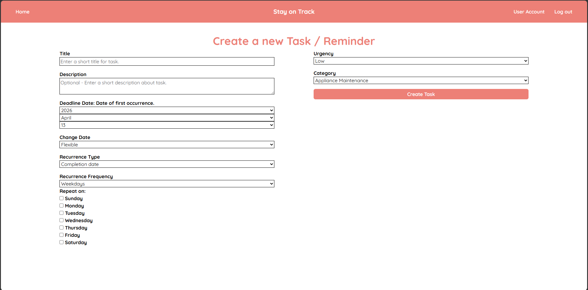  
Fig 7. Task Creation Page.

 
 

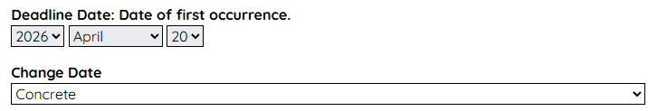  
Fig 8. On Task Creation page the user will be able to set date of first occurence. 

 
 

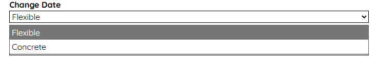  
Fig 9. On Task Creation page the user will be able to select between Flexible 
and Concrete. Flexible allows for the date to be changed and Concrete locks 
the inital set date. 

 
 

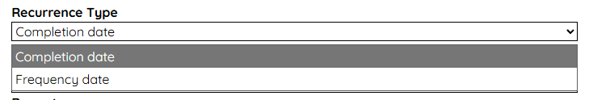  
Fig 10. On Task Creation page the user will be able to select between 
Completion date and Frequency date. Completion date will set next 
recurrence based on when the tasks was completed. Frequency date 
will set next recurrence based on first occurence.

 
 

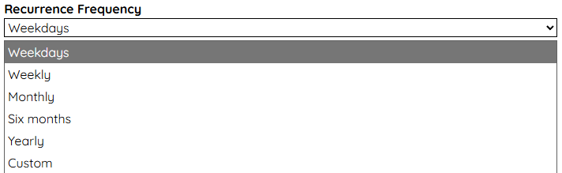  
Fig 11. On Task Creation page the user will be able to select from dropdown 
the frequency of recurrence. There is also a selection option for custom. 

 
 

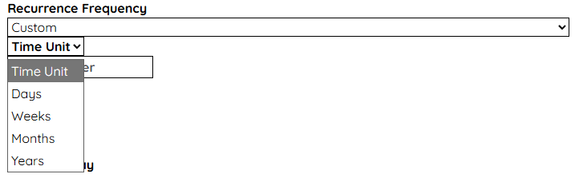  
Fig 12. On Task creation page when selecting custom option in recurrence frequency, 
the user will be able to select time unit and integer value.
Ex: Time unit of weeks and input value of 2 will set frequency to every 2 weeks.

 
 

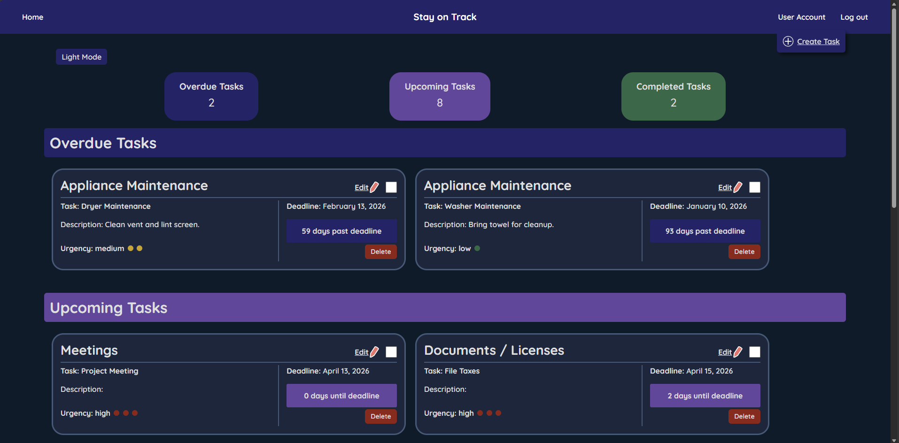  
Fig 13. Theme when dark mode is turned on. The theme is applied to all pages. 

## Test Plan

User-Acceptance Test Strategy:  
The user acceptance testing was performed by having users test specific 
features by following steps. The steps were general to determine if the 
interface is intuitive. The users were observed as they performed the test. 
User surveys were used to receive feedback and gain measurable rating of 
specific qualities, such as ease of use. Feedback was utilized to identify 
usability issues, errors, and areas of improvement. A/B testing was used 
to help determine which layouts are more user-friendly.

User-Acceptance Test Purpose:  
The purpose of the user acceptance testing was to determine that the web 
application met the project requirements and identify errors that users may 
experience when using the application for real-world use. Following each 
testing cycle, users completed a survey to provide feedback on ease of use, 
visual design, and functional performance. The feedback was used to guide 
improvements and future enhancements.

User-Acceptance Test Objectives:  
- Collect baseline feedback on ease of use, visual design, and functional 
performance.
- Refine web application based on user feedback and identified errors.
- Conduct follow-up surveys to gather comparative feedback after refinements and 
measure improvement.
- Perform final evaluation to confirm web application meets requirements and 
satisfies users based on ratings.

## Test Results
Comparison of the User Survey results from start of testing to last round of testing.

Section 1: Ease of Use
- How would you rate the navigation of the web application?
  - 1 - Very difficult to navigate
  - 9 - Very easy to navigate

- How intuitive did you find the web application to be?
  - 1 - Not intuitive, I was confused on how the web application worked.
  - 9 - Very intuitive, I could determine how to complete tasks without 
          confusion.
    
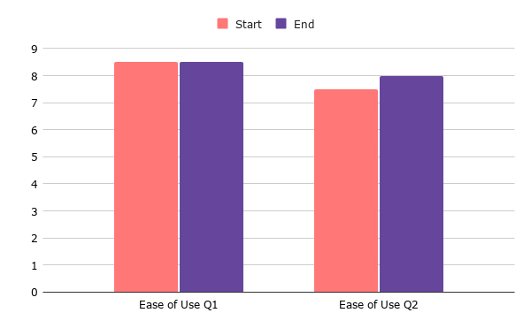

Section 2: Visual design
- How would you rate the following statement? The layout of the web application 
  was very appealing.
  - 1 - Strongly disagree
  - 9 - Strongly agree

- How would you rate the following statement? The design elements enhanced 
  usability. (Fonts, colors, spacing, etc.)
  - 1 - Strongly disagree
  - 9 - Strongly agree

- How would you rate the following statement? The interface felt modern and 
  professional.
  - 1 - Strongly disagree
  - 9 - Strongly agree
    
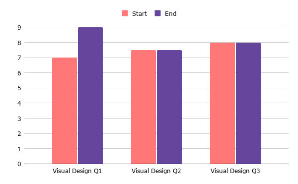

Section 3: Functionality
- How would you rate the following statement? Features worked as expected 
  without errors.
  - 1 - Strongly disagree
  - 9 - Strongly agree  

- How would you rate the following statement? I was able to accomplish the 
  intended tasks successfully.
  - 1 - Strongly disagree
  - 9 - Strongly agree
    
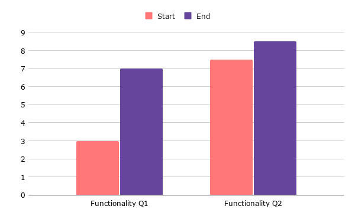

Section 4: User Satisfaction 
- How would you rate the following statement? I would consider using this 
  application in real-world scenarios.
  - 1 - Strongly disagree
  - 9 - Strongly agree
    
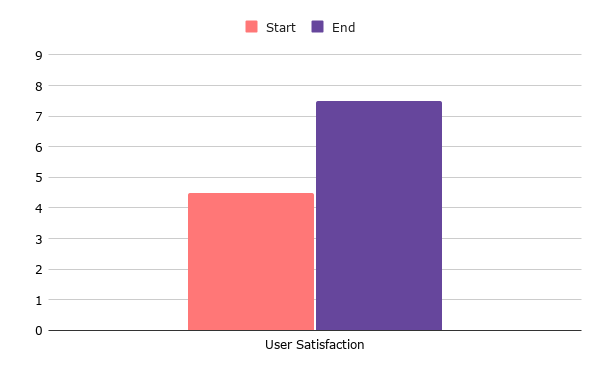

## Challenges Overcome
This project was challenging as previous projects I have completed involved 
working in teams. Another added challenge was completing the project while 
also handling a heavy course load which made balancing my time essential. 
I overcame that challenge by having specific check-ins every two weeks to 
report progress to the advisor. 

While working on the project construction I had to essentially learn as I progress as 
the features were unique compared to my past projects. Looking at the Ruby on Rails 
documentation and searching error messages were helpful in gaining more knowledge. 
During the testing phase, having other people perform the user testing provided 
valuable information. They were able to catch issues such as unclear text, errors 
in functions, and with the A/B testing provided input on which layout was the better. 

Overall referencing guides and tutorials listed in the earlier Research and Background section above  
were useful in fixing the errors and getting the web application to its current state. 

## Future Enhancements
The future enhancements includes the features that were in requirements:
- Email notifications
- Search function
- Mobile optimization (app version)
- Linking accounts
- Calendar view
- Schedule blocking
- Customization
- Accessibility 

## Defense Slides
[Stay on Track Senior Defense Presentation](/pdf/Senior-Project-Defense.pdf)

[Back to Portfolio](./)
