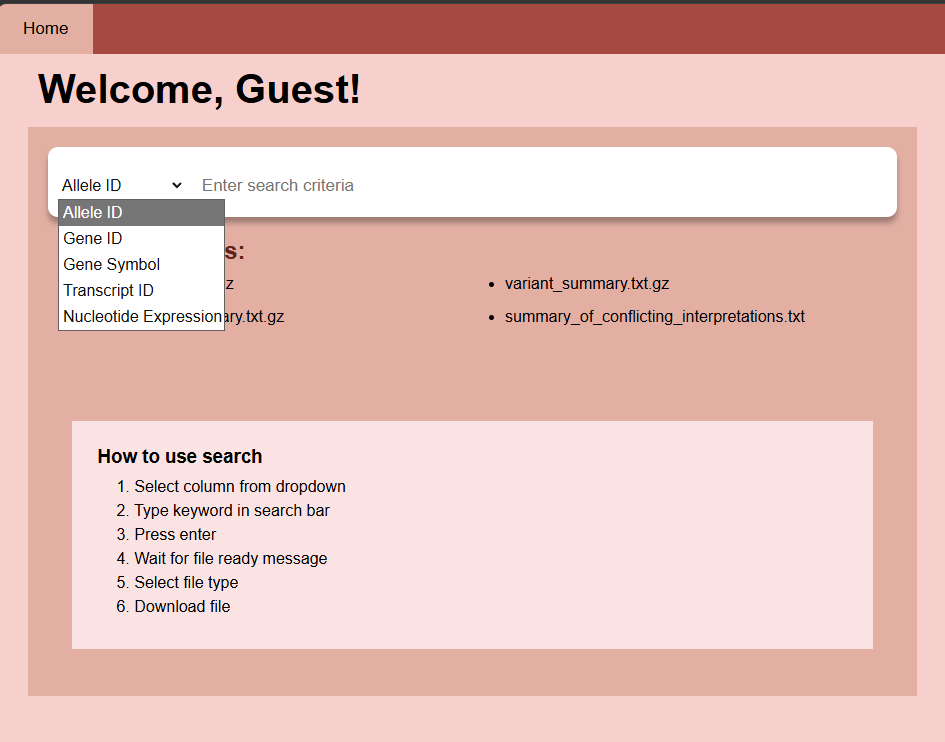
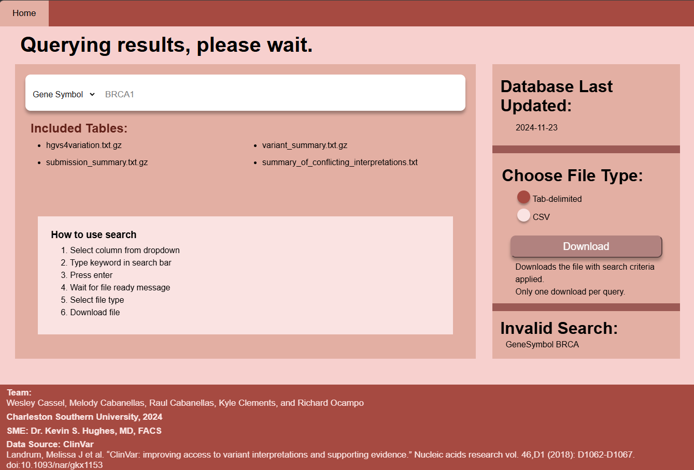
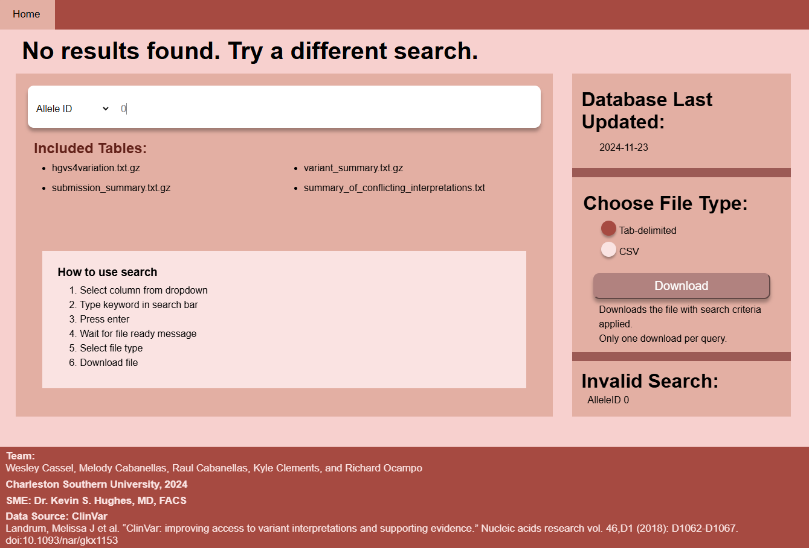

[Back to Portfolio](./)

ClinVar Database Filter
===============

-   **Class: Systems Analysis and Software Design CSCI 495** 
-   **Grade: A** 
-   **Language(s): HTML, CSS, Java, Javascript, SQL** 
-   **Source Code Repository:** [ClinVar - Red Team](https://github.com/mcabane/CSCI-495-ClinVar-Project-MC)  
    (Please [email me](mailto:mj4cabane@gmail.com?subject=GitHub%20Access) to request access.)

## Project description

Worked alongside a team of four to create a web application for a client. The program pulls the gene variant data from ClinVar and stores it in the 
SQL databased combining the four tables into one. This database would be updated weekly automatically to ensure the information was up-to-date. The user would
use the search field and dropdown to filter the data from the database. The results from the filtering would then be formated based on the file format chosen by the 
user. The file would then be downloaded after the user clicks the download button. I designed the user-interface and programmed filtering logic for SQL database. 
I also assisted with back-end integration and enabled multi-format data export of filtered results.

## How to compile and run the program

How to compile (if applicable) and run the project.

Clone repository
Install 
- Node.js
- SQL Workbench
- SQL server
- Java Orcale JDK
  
```bash
cd ./project
npm install
node index.js
```
Once the server is running, the web page can be seen on http://localhost:3000

## UI Design

  
Fig 1. The homepage  

<br/>


Fig 2. This section has the search bar and dropdown to filter the results. The section also has a short tutorial guide
on how to use web page.  

<br/>


Fig 3. This section contains information of the last database, file type selector and download button. The bottom of the 
section displays the past searches that resulted in a failed query.  

<br>

  
Fig 4. Example of search querying.  

<br>

  
Fig 5. Example of when search is complete and file is ready for download.  

<br>

  
Fig 6. Example of when invalid search resulted in failed query.  

## 3. Additional Considerations

ClinVar has since updated their website which means this project may no longer be able to update the database. 

[Back to Portfolio](./)

