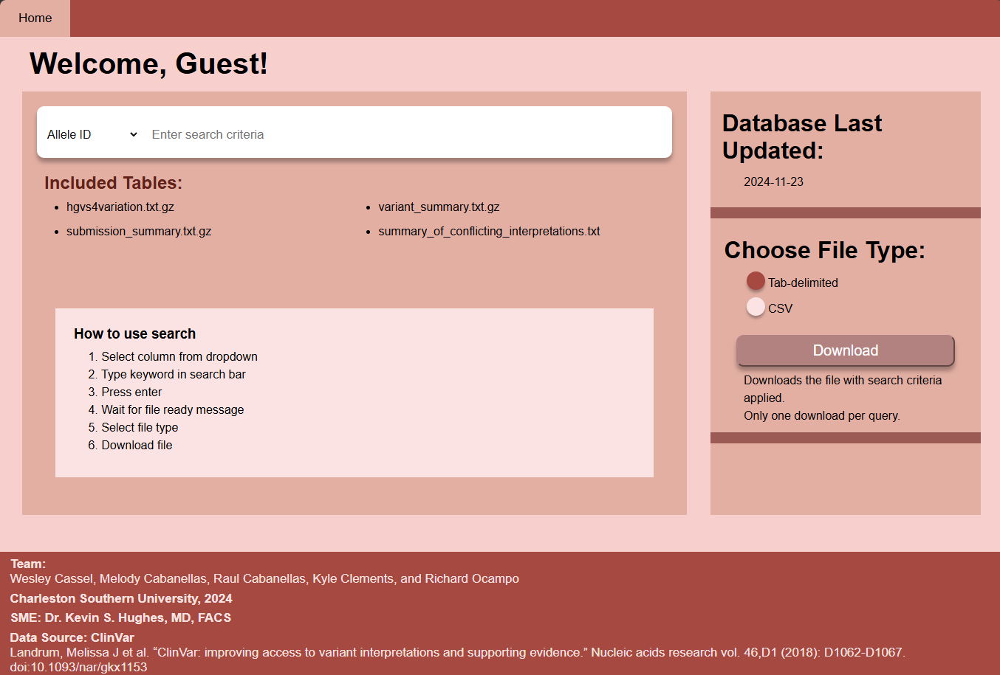

[Back to Portfolio](./)

Charity Run Website
===============

-   **Class: User-Interface Programming CSCI 334** 
-   **Grade: A** 
-   **Language(s): HTML/CSS, Ruby on Rails** 
-   **Source Code Repository:** [Charity Run Repository](link)  
    (Please [email me](mailto:mj4cabane@gmail.com?subject=GitHub%20Access) to request access.)

## Project description

The project was completed in a team of two. This project utilized the Ruby on Rails to create a website for a fictional Charity run. The website had to inform users about the run, have account creation, have admin privileges, and have runners able to form teams. 

## How to compile and run the program

 

## UI Design

  
Fig 1. 

## 3. Additional Considerations

## 4. Other Team Members

[Back to Portfolio](./)

