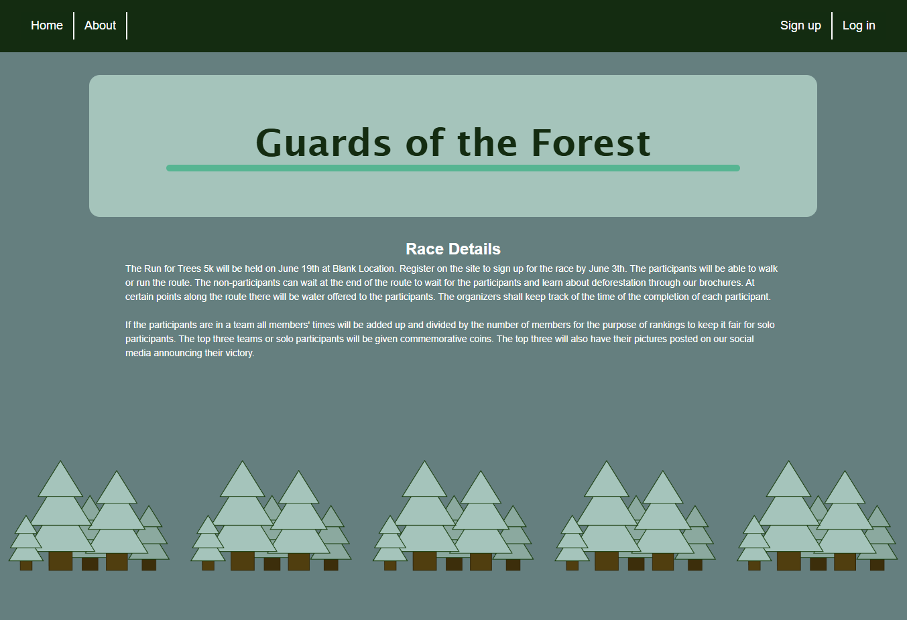
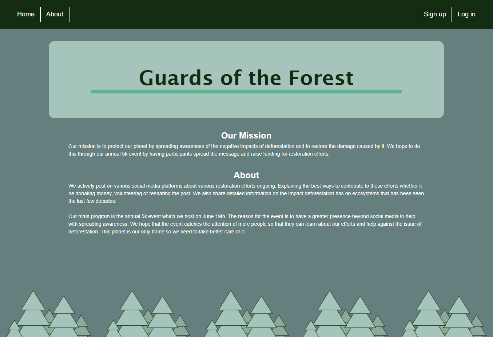
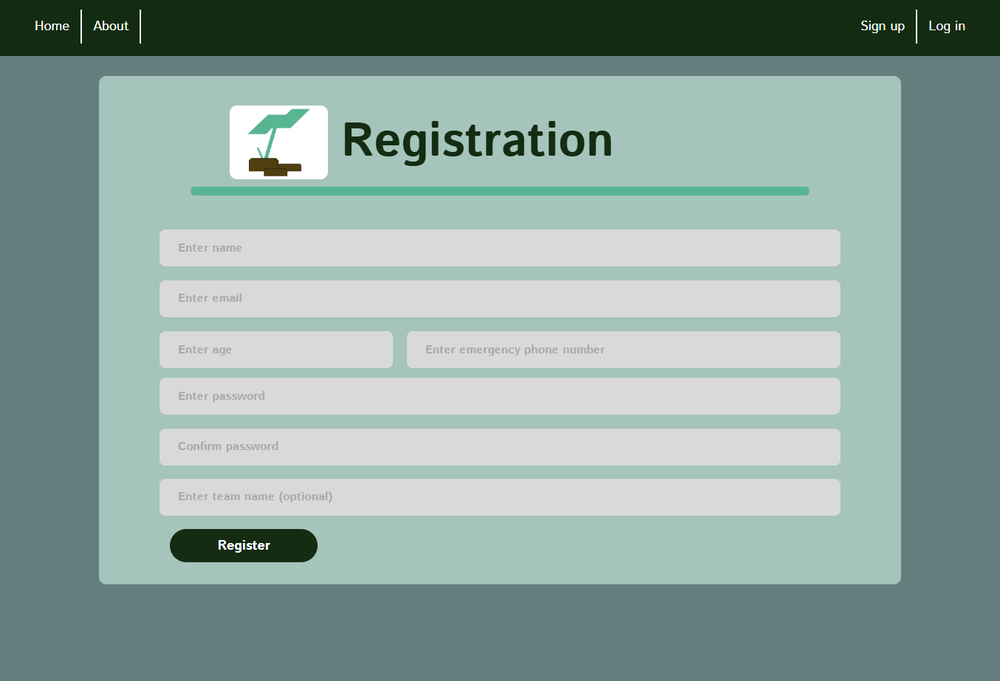
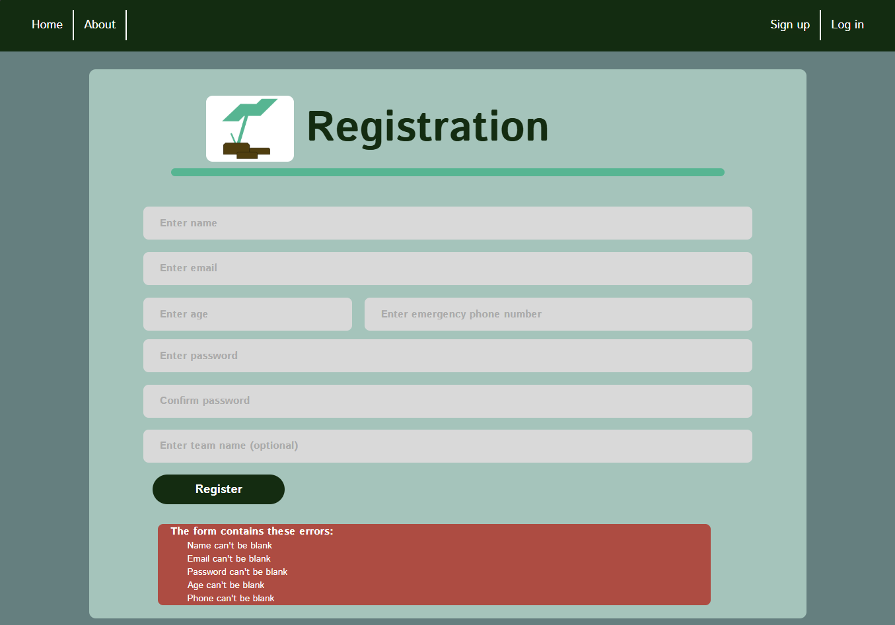
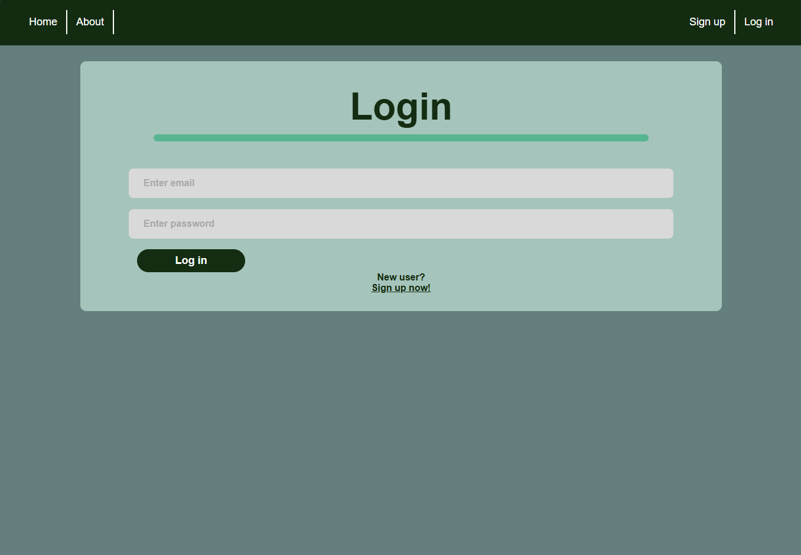
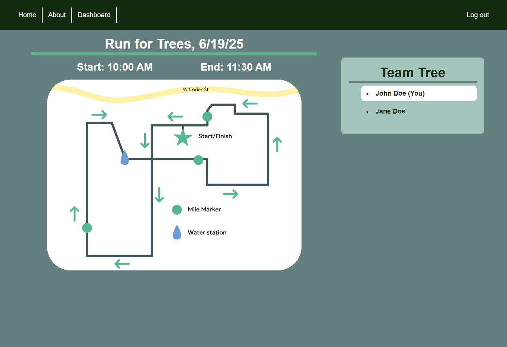
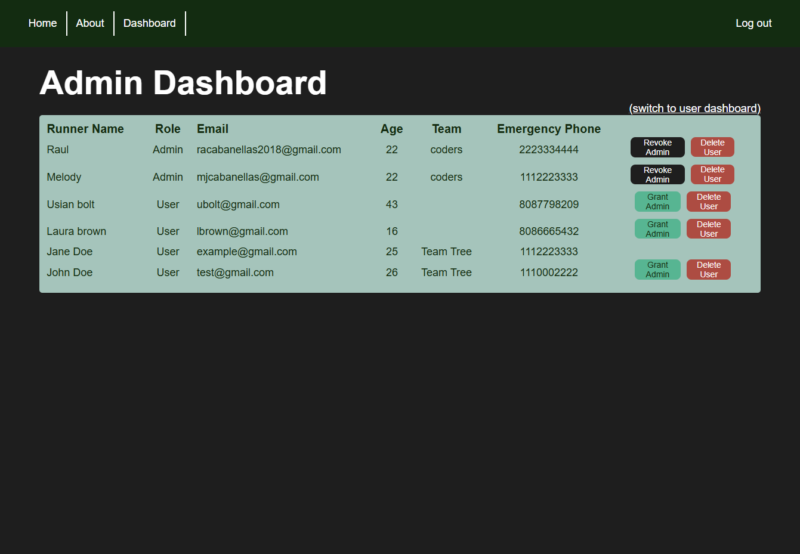

[Back to Portfolio](./)

Charity Run Website
===============

-   **Class: User-Interface Programming CSCI 334** 
-   **Grade: A** 
-   **Language(s): HTML/CSS, Ruby on Rails** 
-   **Source Code Repository:** [Charity Run Repository](https://github.com/mcabane/charity-run-mc)  
    (Please [email me](mailto:mj4cabane@gmail.com?subject=GitHub%20Access) to request access.)

## Project description

The project was completed in a team of two. This project utilized the Ruby on 
Rails framework to create a website for a fictional Charity run. The website 
had to inform users about the run, have account creation, have admin privileges, 
and have runners able to form teams. 

## How to compile and run the program

Clone repository
```bash
cd charity_run_new
bundle install (Note: have Ruby 3.1.2 installed)
rails db:create
rails db:migrate
rails server
```

## UI Design

   
Fig 1. Home Page.  

<br/>


Fig 2. About Page.    

<br/>

  
Fig 3. Sign-Up Page where user inputs: name, email, age, emergency phone, password, and team name (optional).  

<br/>

  
Fig 4. Example of validation check when signing up.   

<br/>

  
Fig 5. Login Page.  

<br/>

  
Fig 6. Example of the user dashboard where runners can see race info and team members if they are in a team.   

<br/>

  
Fig 7. Admin dashboard where they can see all runners and are able to grant/revoke admin or delete runners.   


Fig 8. Example of website on mobile screen. 

<br/>

## 3. Additional Considerations
The map is only for display purposes. 

## 4. Other Team Member
- Raul Cabanellas


[Back to Portfolio](./)

