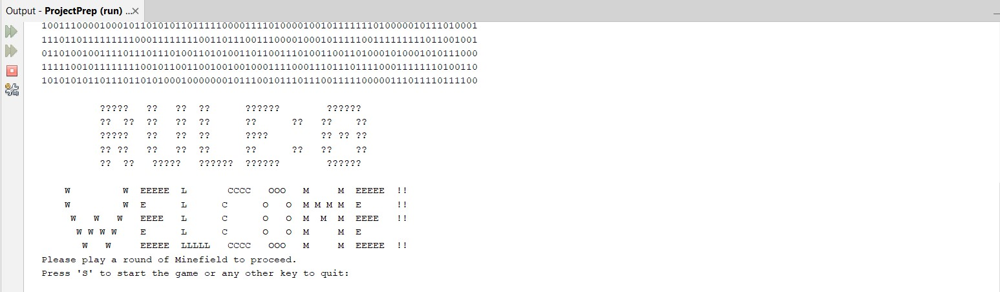
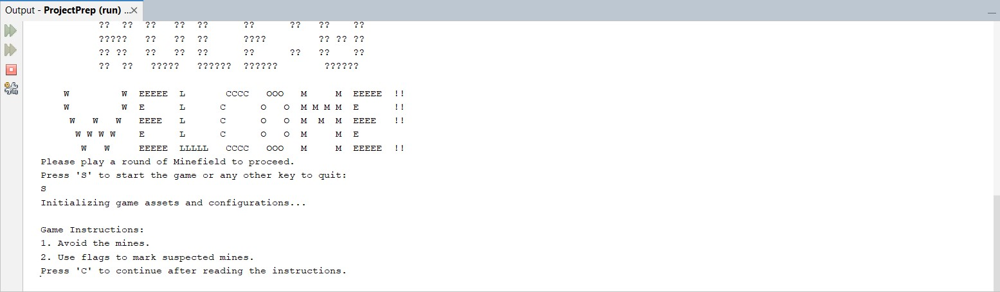
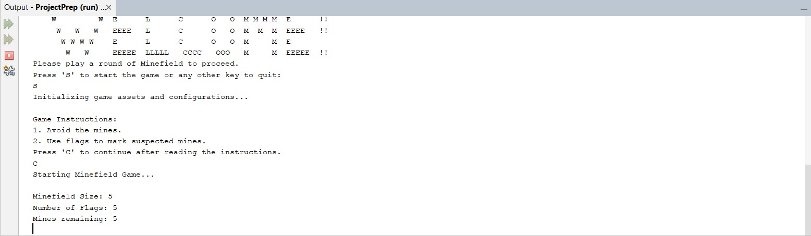
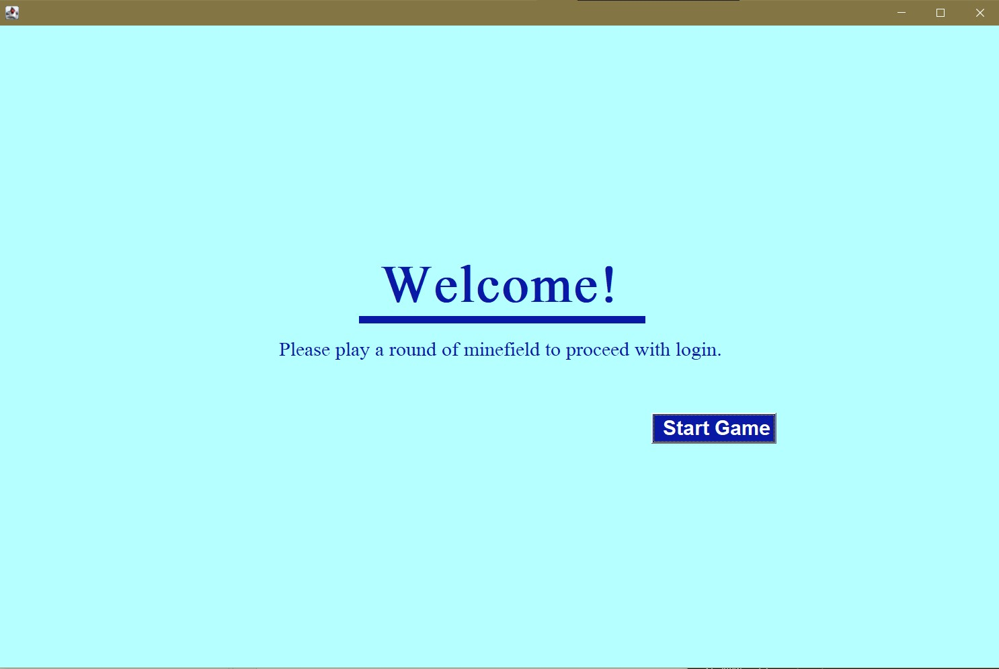
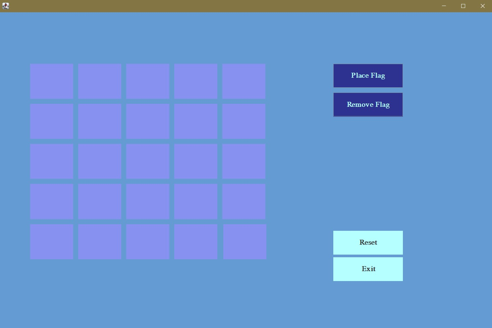
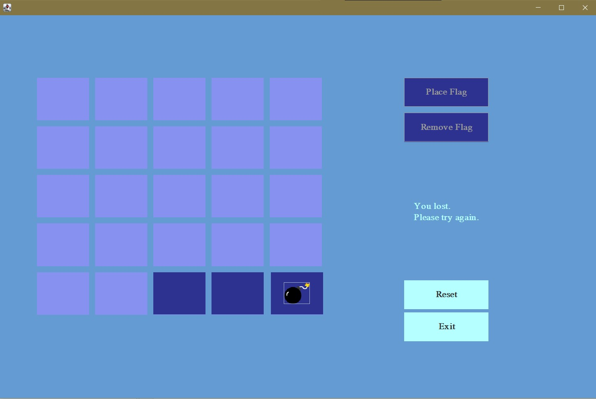
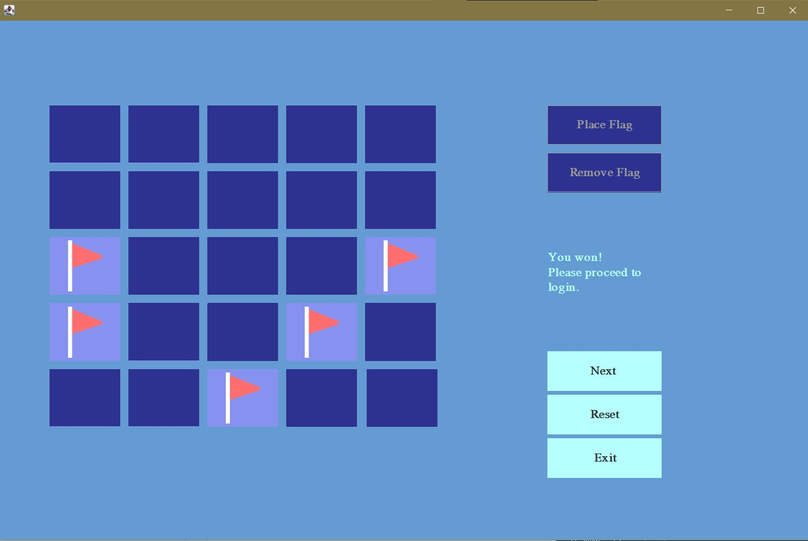
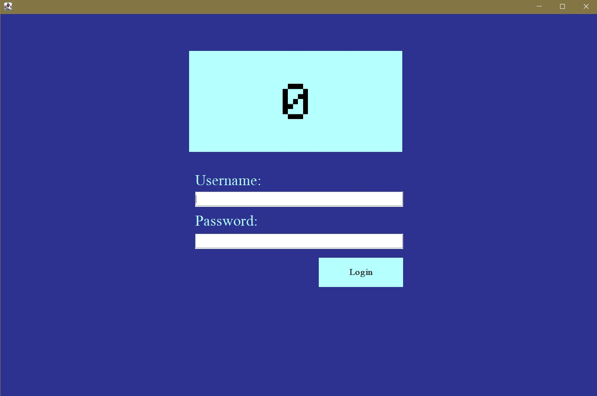

[Back to Portfolio](./)

Minefield Login
===============

-   **Class: Object-Oriented Programming CSCI 325** 
-   **Grade: A** 
-   **Language(s): Java** 
-   **Source Code Repository:** [Minefield Login Repository](https://github.com/mcabane/CSCI-325-Minefield-Login)  
    (Please [email me](mailto:mj4cabane@gmail.com?subject=GitHub%20Access) to request access.)

## Project description

This project was completed in a team of five. This project based on the idea of 
making a login tedious to complete not meant for actual real-world use. The 
project is similar to a captcha, the user must complete a game of minesweeper 
before being able to login. The board is 5 x 5 board with 5 bombs that must not 
be tripped. I was the one who designed and programmed the GUI, as well as 
created the icons of the flag, bomb, and logo. 

## How to compile and run the program

- Install Apache Netbeans IDE
- Import Project Folder into Netbeans
- Run the Project
- Follow Instructions in Console.

## UI Design
The design intentionally used harder contrast tiles for the purpose of added 
difficulty.    
  
Fig 1. The console welcome screen when running the program in NetBeans.  

 

 
Fig 2. The console screen of the game instructions.  

 

 
Fig 3. The console screen of the game rules.  

 

 
Fig 4. The Welcome screen.  

 

 
Fig 5. The Minefield after pressing the 'Next' button.   

 

 
Fig 6. Example of game end when finding a bomb.   

 

 
Fig 7. Example of completed game with all bombs flagged.  

 

Fig 8. Login Screen.  

 

## 3. Additional Considerations

## 4. Other Team Members
- Raul Cabanellas
- Noah Huber
- Ashton Cook  

[Back to Portfolio](./)
